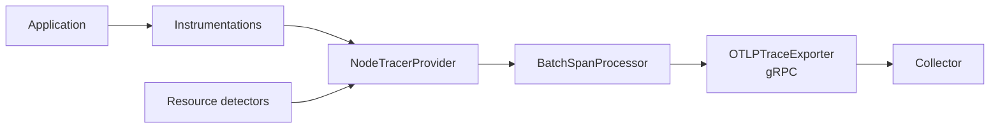

# Architecture

`setupTracing` assembles a tracer provider, registers it as the global provider, and registers the instrumentations against it. Everything the OpenTelemetry Node SDK needs is configured in one place, so a caller passes a service name and an endpoint rather than a pipeline.

## The pipeline

| Stage | Component | Configuration |
|-------|-----------|---------------|
| Provider | `NodeTracerProvider` | Resource from detectors, merged with the explicit service and container attributes |
| Processor | `BatchSpanProcessor` | `maxQueueSize` 4096, `maxExportBatchSize` 1024, `scheduledDelayMillis` 2000, `exportTimeoutMillis` 10000 |
| Exporter | `OTLPTraceExporter` | OTLP over gRPC, `timeoutMillis` 10000, `concurrencyLimit` from the options (default 10) |
| Registration | `tracerProvider.register()` | Installs the async local storage context manager and a composite W3C Trace Context and baggage propagator |

Spans are batched rather than exported one at a time. A span is therefore visible in the backend up to `scheduledDelayMillis` after it ends, and a process that exits without calling [`stopTracing`](usage.md#shutdown) drops whatever is still queued.

## Resource attributes

The resource is built in two steps. Detection runs first, then the explicit attributes are merged on top, so an explicitly passed service name wins over one found by the environment detector.

| Source | Attributes |
|--------|------------|
| `envDetector` | Anything set in `OTEL_RESOURCE_ATTRIBUTES` |
| `hostDetector` | `host.name`, `host.arch` |
| `osDetector` | `os.type`, `os.version` |
| `processDetector` | `process.pid`, `process.command`, `process.runtime.*` |
| `serviceInstanceIdDetector` | `service.instance.id` |
| Explicit | `service.name`, and `container.name` when a hostname is resolved |

`container.name` is omitted entirely when no hostname is passed and neither `CONTAINER_NAME` nor `HOSTNAME` is set, rather than written as an undefined value.

## Propagation

`register()` is called without overrides, which installs the `AsyncLocalStorageContextManager` and a composite propagator of W3C Trace Context and W3C Baggage. An incoming request carrying `traceparent` continues the caller's trace, and every outgoing HTTP or fetch call injects one.

This is what pairs a caller's client span with the callee's server span. A service graph is built from those pairs, so propagation is the prerequisite for one.

## Service graph attributes

Tempo names a service graph node from `peer.service`, and no instrumentation emits that attribute. The library sets it in the request hooks instead.

| Call | Where `peer.service` comes from |
|------|---------------------------------|
| Outgoing HTTP | The `host` of the outgoing `ClientRequest`, matched against the known peer list |
| Outgoing fetch | The `origin` of the undici request, matched against the same list |
| IORedis | Set to `redis` unconditionally |
| AWS SDK | The AWS service name from the request, lower cased |

The known peer list holds `elasticsearch` and `redis`. A host containing either substring sets both `peer.service` and `db.system.name` to that value.

Only outgoing requests carry `host`, so the HTTP hook returns without setting anything when there is none. That keeps server spans out of the graph as peers, where `peer.service` has to name the remote service being called rather than the local one.

## Idempotency

The provider is held in module scope. `setupTracing` returns early when it is already set, logging a warning and returning a tracer from the existing provider, so repeated initialisation cannot register a second set of instrumentations or a second exporter against the same process.

`stopTracing` awaits the provider shutdown, which flushes queued spans, then clears the module scope reference. A later `setupTracing` call therefore builds a fresh pipeline.

## Diagnostics

The OpenTelemetry diagnostic logger is set to a console logger at `INFO` level when the module is imported, before `setupTracing` runs. Exporter failures, instrumentation warnings and the messages this library emits are all written to the console through it.
